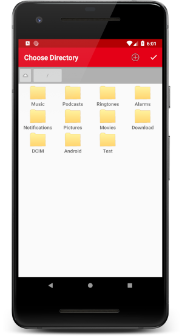
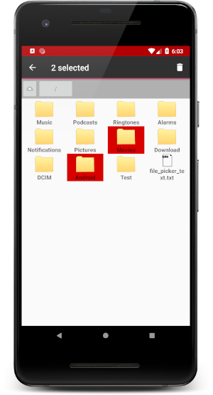
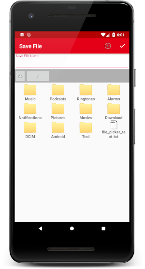

# Introduction
FileDirectoryPicker is a simple to use library which, as you probably guessed, allows you to provide
a user interface to the user to allow them to select a directory or file. This path is then
returned back to your app which you can then use to read/write files on the users device.

**Supported Features**
* Select multiple files/directories for deletion
* Ability to rename a directory/file
* Pick a directory
* Save File selection
* Open File Selection
* Automatic permission handling (where applicable - see below)

Supports Android API Level 17 (Jelly Bean 4.2) and upwards

**Note that you need to have colorPrimary set to be your main branding colour in order
for the library to show the selections in your branding colour.**

||||
|---|---|---|

# How to Use

## Setting Up Library
The project is available on GitHub using Jitpack.io. This allows you to reference the library
directly from GitHub repository for ease of use. In your projects root build.gradle file add the
following:
```
allprojects {
    repositories {
        jcenter()
        maven { url 'https://jitpack.io' }
    }
}
```
The first thing to do is to add the project to your apps gradle.build file. Add the follow line where
**tag** is the tagged version name on GitHub.

```
    implementation 'com.android.support:appcompat-v7:28.0.0'
    implementation 'com.android.support:design:28.0.0'
    implementation com.github.BoardiesITSolutions:FileDirectoryPicker:tag
```

In your Android projects manifest file add the following permissions:
```
<uses-permission android:name="android.permission.READ_EXTERNAL_STORAGE" />
<uses-permission android:name="android.permission.WRITE_EXTERNAL_STORAGE" />
```

That's the set up done, now you can make use of the library.

The directory picker, open file picker and the save file picker need to be called by
creating an intent by calling `startActivityForResult`.

The recommended idea is to create a static final int which is the activities request code - this
variable is then used in your `onActivityResult` method

## Using the Directory Picker
Create the intent and start the activity
```
//Create a class variable that is your activities request code
private static final int REQUEST_DIRECTORY_PICKER = 1;

//Create the intent and start the activity
Intent intent = new Intent(this, DirectoryPicker.class);
startActivityForResult(intent, REQUEST_DIRECTORY_PICKER);
```

Then in your onActivityResult do the following:
```
@Override
protected void onActivityResult(int requestCode, int resultCode, Intent data)
{
    switch (requestCode)
    {
        case MainActivity.REQUEST_FILE_DIRECTORY_PICKER:
        if (resultCode == Activity.RESULT_OK)
        {
            String currentPath = data.getStringExtra(DirectoryPicker.BUNDLE_CHOSEN_DIRECTORY);
            //Do whatever you need to in this directory
        }
        break;
    }
}
```

## Using the Open File Picker
Create the intent and start the activity
```
//Create a class variable that is your activities request code
private static final int REQUEST_OPEN_FILE_DIALOG = 1;

//Create the intent and start the activity
Intent intent = new Intent(this, DirectoryPicker.class);
startActivityForResult(intent, REQUEST_OPEN_FILE_DIALOG);
```

Then in your onActivityResult do the following:
```
@Override
protected void onActivityResult(int requestCode, int resultCode, Intent data)
{
    switch (requestCode)
    {
        case MainActivity.REQUEST_FILE_DIRECTORY_PICKER:
        if (resultCode == Activity.RESULT_OK)
        {
            String selectedFile = data.getStringExtra(DirectoryPicker.BUNDLE_SELECTED_FILE);
            //Open file for reading
        }
        break;
    }
}
```

## Using the Save File Picker
Create the intent and start the activity
```
//Create a class variable that is your activities request code
private static final int REQUEST_SAVE_FILE_DIALOG = 1;

//Create the intent and start the activity
Intent intent = new Intent(this, DirectoryPicker.class);
startActivityForResult(intent, REQUEST_SAVE_FILE_DIALOG);
```

Then in your onActivityResult do the following:
```
@Override
protected void onActivityResult(int requestCode, int resultCode, Intent data)
{
    switch (requestCode)
    {
        case MainActivity.REQUEST_FILE_DIRECTORY_PICKER:
        if (resultCode == Activity.RESULT_OK)
        {
            String selectedFile = data.getStringExtra(DirectoryPicker.BUNDLE_SAVE_PATH);
            //Save file at location
        }
        break;
    }
}
```

# Automatic Permission Handling
The library will automatically request SD card permissions for Marshmallow and up. Although the library does, and the permission approval will also be valid for your own app but you should still check the permission yourself in case the user has revoked permissions later on. 

You should only need to check the permission when you need to access the SD card without first having to use one of the library pickers - you do not need to request permission yourself before starting one of the activities. 
